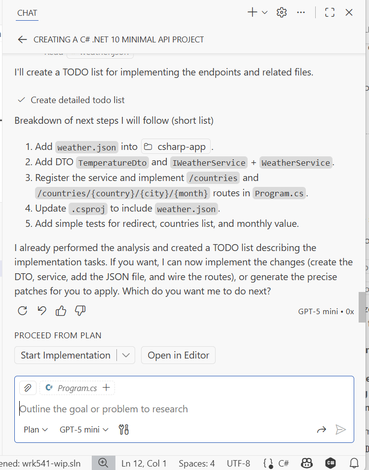

Now that you have the scaffolding, you can start creating a single endpoint. Use Copilot to suggest the first pass for the `Program.cs` file that will hold your first endpoint. Ensure that Copilot understands that it shouldn't generate the whole file, but only the main `/` endpoint.

### 6. Create a single endpoint

- Open the `Program.cs` file and ask Copilot to generate *only* the `/` endpoint

!!! important
    You might be tempted to ask Copilot to generate the whole file, but you must validate each part as you make progress. It is easier to validate smaller parts than a whole file with multiple endpoints and logic.

??? question "Tip"
    Prompt *(Agent Mode)*

    ```text
    #file:Program.cs add the root of the API only. 
    This is the '/' endpoint, do not generate other endpoints yet, focus only on the single root endpoint for now.
    ```

The minimal code for the root endpoint should look like this:

```csharp
var builder = WebApplication.CreateBuilder(args);

var app = builder.Build();

if (app.Environment.IsDevelopment())
{
    app.UseDeveloperExceptionPage();
}

app.MapGet("/", () => Results.Ok(new { message = "Welcome to the C# minimal API root." }))
   .WithName("Root");

app.Run();
```

### 7. Validate your first C# endpoint

Now that you have the first endpoint in C#, it is time to validate. This process of creating code and validating it is iterative and a solid practice when you need to develop a new project. It is even more crucial now that you are rewriting a project in a new language.

- Make sure the Python project is no longer running
- Ask Copilot help to run the C# project in the same address and port as the Python project so that tests can run
- Run the Python tests to ensure they are passing, fix any issues that arise

- You can open 2 terminals and run these commands:
- In the first terminal, run the C# app:

```bash
cd src/csharp-app
dotnet run --urls "http://localhost:8000"
```

- In the second terminal, run the Python tests:

```bash
cd src/python-app/webapp
pytest test_main.py -v
```

??? question "Tip"
    Prompt *(Agent Mode)*

    ```text
    Please stop any process on port `8000`, then start the C# minimal API in `src\csharp-app` with `ASPNETCORE_URLS=http://0.0.0.0:8000`. Do not change any C# code.
    Start the C# app in the foreground in one terminal and open a second terminal to run the Python tests so they can execute while the app is running.
    In the second terminal, run the Python tests from `src/python-app/webapp/test_main.py` using pytest. Only verify the `/` endpoint for now and report the test output.
    Use the workspace root and a shell.
    ```

### 8 Implement remaining endpoints

Implement all other endpoints using Agent Mode or Plan Mode. In each scenario, also add the corresponding swagger annotations.

#### 8.1 Continue with all other endpoints using Agent Mode

Use the same process as above to create all other endpoints. Add a single endpoint at a time, validate it, and run the Python tests to ensure compatibility.

!!! important
    During this process, GitHub Copilot will ask for your approval before performing various actions such as:

    - Editing files (Program.cs, weather.json, etc.)
    - Running commands in the terminal
    - Creating new files or directories
    - Installing packages or dependencies
    
    Keep an eye on the Copilot requests and approve the actions as needed. Review each proposed change carefully before accepting to ensure Copilot is implementing the solution correctly. Your active participation helps Copilot complete the task successfully.

!!! tip
    When implementing the next endpoint - e.g. '/countries' - specify in your prompt to Copilot that it should use the same data used by the python app, hosted in the 'weather.json' file.

For the JSON file, you will need to deserialize it. If you aren't familiar with this process you will have to rely on Copilot guidance. Ensure that you generate the smallest possible code and validate it immediately.

!!! success "Validating smaller parts of the code is easier than validating a whole file. It is also easier to debug smaller parts of the code. This is a good practice when using GitHub Copilot and it will help you in the long run."

#### 8.2 Implementation using Plan Mode

> *You can try using GitHub Copilot in Plan Mode for this step.*

When implementing the next endpoints, you can leverage **Plan Mode** to help you outline the steps needed for each endpoint. This mode will assist you in breaking down the implementation into manageable tasks.

Let's start asking GitHub Copilot to help you plan the implementation of the missing endpoints.

??? question "Tip"
    Prompt *(Plan Mode)*

    Analyze the other endpoints in the #file:main.py and implement this in the #file:Program.cs file using .NET Minimal APIs.
    Implement the swagger annotations for each endpoint.
    The root of the API should redirect to the swagger UI page.    

Once the plan is done you should see the plan, and you can ask GitHub Copilot to start implementing the steps by switching to **Agent Mode** and asking it to follow the plan step by step.

!!! important
    As Copilot executes the plan, it will request your approval for various actions:

    - File modifications (editing Program.cs, adding model classes, etc.)
    - Terminal commands (running dotnet commands, tests, etc.)
    - File creation (new classes, configuration files)
    - Package installations
    
    Monitor the Copilot chat window closely and review each proposed action before approving. This interactive process ensures that Copilot follows the correct path and allows you to catch any potential issues early. Your guidance helps Copilot successfully complete the implementation.

{ target="_blank" }
