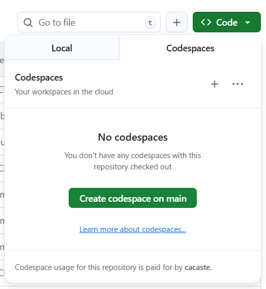
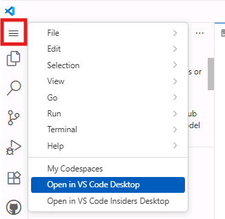

# Opening the Repository (Local or GitHub Codespaces)

Choose the workflow that best fits your setup. If you're working locally in your development environment, we assume all required tools are already installed (see the Resources page for a quick prerequisite checklist). If you prefer a fully hosted experience, follow the GitHub Codespaces path.

!!! note "Event attendees"
    If you are attending this workshop at a Microsoft event (where a pre-provisioned lab environment is available), you can still follow the **Local environment** instructions if you prefer to work on your own machine. The Local environment steps assume you will provide any required credentials and resources locally instead of using the event lab. See the event guidance for details about the lab resources and credentials.

=== "Local environment"

    1. Open the repository page: [Real World Code Migration with GitHub Copilot Agent Mode](https://github.com/microsoft/aitour26-WRK541-real-world-code-migration-with-github-copilot-agent-mode){:target="_blank"}
    
    1. Clone the repo to a working folder on your machine:
    
        ```bash
        git clone https://github.com/microsoft/aitour26-WRK541-real-world-code-migration-with-github-copilot-agent-mode.git
        ```
    
    1. In VS Code, choose **File > Open Folder** and select the cloned folder.
    
    1. Sign in to GitHub in VS Code and ensure GitHub Copilot is enabled. (Command Palette → **GitHub: Sign in**.)
    
    1. Restore dependencies for the python project:
    
        ```bash
        cd src/python-app && pip install -r requirements.txt`
        ```
    
    1. You're ready to follow the rest of the workshop locally. If you need the tool list, see the **Local environment prerequisites** section on the Resources page.

=== "GitHub Codespaces"

    1. Visit the repository: [Real World Code Migration with GitHub Copilot Agent Mode](https://github.com/microsoft/aitour26-WRK541-real-world-code-migration-with-github-copilot-agent-mode){:target="_blank"}
    2. Log into your GitHub account.
    3. Click the **Star** button in the top right corner—this makes it easy to find later.
    4. Click the **<> Code** button, open the **Codespaces** tab, then select **+** to create a new Codespace.
    
        
    
    5. Wait for the Codespace to finish provisioning in the browser.
    6. Once the Codespace is ready, you'll see a VS Code experience in the browser. You can continue there or click **Open in VS Code** to connect from your desktop.
    
        

!!! success
    To revisit the workshop later, click your profile picture on GitHub and select **Your stars**.
