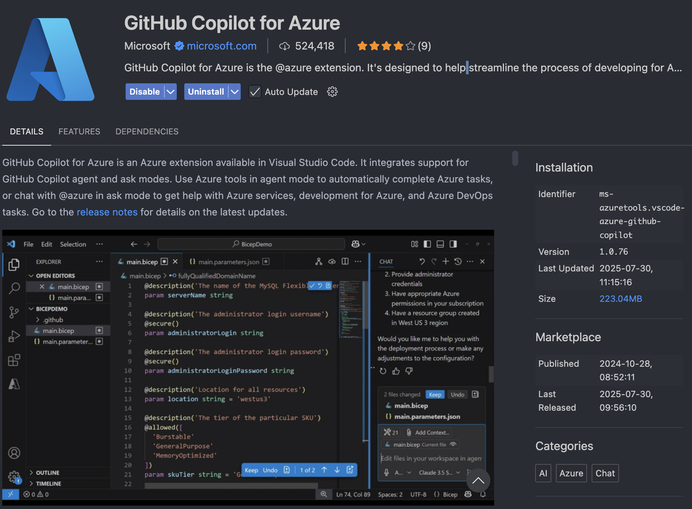

# 宿題 (Homework)

ワークショップ完了おめでとうございます！学びを定着させ、追加の概念を探求できる課題と拡張プロジェクトを用意しました。

### Take Home Challenge: Azure へのデプロイ

すべてのステップ（コンテナ化を含む）を終えたら、アプリを Azure にデプロイしてみましょう。必要なもの:

- Azure アカウント
- [GitHub Copilot for Azure 拡張](https://marketplace.visualstudio.com/items?itemName=ms-azuretools.vscode-azure-github-copilot)
  - デプロイ手順の質問やガイダンスに役立ちます

1. Azure にサインイン後、`@azure` を使ってコンテナ化した C# アプリのデプロイ方法を質問
1. 提案されたサービス（例: Azure Container Apps / Azure App Service）でコンテナをデプロイ
1. デプロイ後、コンテナが動作していることを検証

最後に、不要なクラウド課金を避けるため、リソースを必ずクリーンアップしてください。
