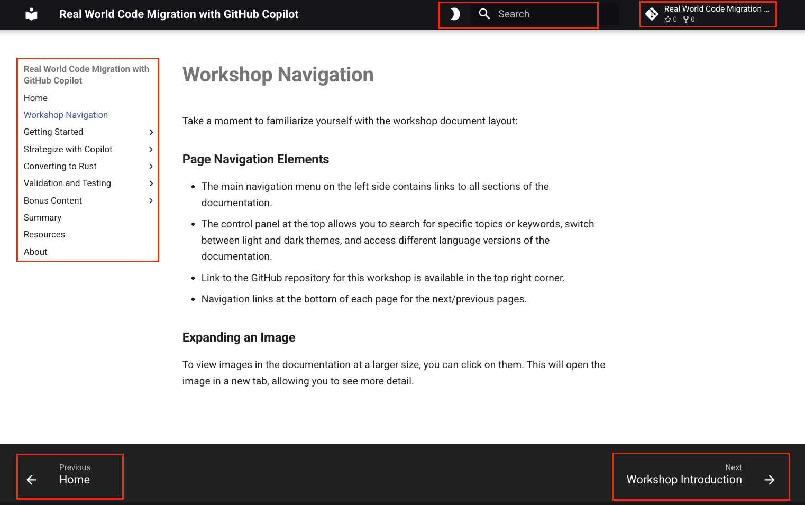

# ワークショップドキュメントのレイアウト

ワークショップドキュメントのレイアウトに慣れましょう。

## ページのナビゲーション

- 左側のメインメニュー: すべてのセクションへのリンク
- 上部のコントロールパネル: 検索、テーマ切替、言語切替
- 右上: GitHub リポジトリへのリンク
- 下部: 次/前ページへのナビゲーションリンク

### 画像の拡大

画像をクリックすると新規タブで拡大表示され、詳細を確認できます。

{ target="_blank" }

### コードスニペットのコピー

ハイライトされた灰色のボックスがコード/テキストスニペットです。右側に表示されるコピーアイコンをクリックしてコピーできます。

```text
# Example text snippet
```

### ノートの種類

!!! tip "Tip"
    素早く役立つ洞察や提案を示します。

!!! note
    重要事項を強調します。

??? question "Tip (click to expand)"
    クリックで展開し、次のコード/プロンプト例を示します。

!!! warning
    指示と補完情報。結果達成に重要です。

!!! bug
    依存関係や AI モデル/エージェントの非決定性など、うまくいかない可能性を説明します。
