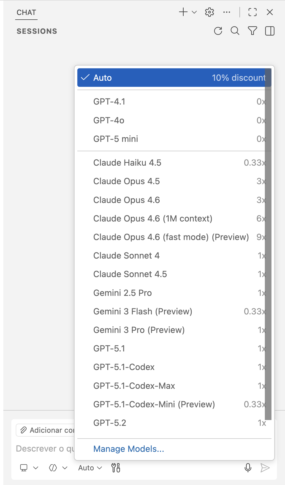

<!-- markdownlint-disable MD046 -->

# プロジェクトを理解する

コード移行前に、対象プロジェクトを理解することが重要です。

## Python プロジェクトから始める

プロジェクト構造に慣れましょう。メインファイルは `main.py` で、`src/python-app/webapp` 配下にあります。
このファイルにアプリの主要ロジックがあります。

### 1. プロジェクト探索

> このステップは Ask Mode で Copilot を使ってみましょう。

Windows は `Ctrl + Alt + I`、Mac は `Command + Shift + I` で Copilot を開き、
**Ask Mode** になっていることを確認:


!!! note
    Copilot は LLM ベースで非決定的です。同じ入力でも異なる応答になることがあります。本リポのプロンプトは **GPT-5-mini** で検証済みなので、ドロップダウンから選択するのも一案です。他モデルも試せます。



`#codebase` ツールで Copilot にプロジェクトの文脈を与え、概要を説明してもらいましょう。

- Copilot チャットでプロンプト先頭に `#codebase` を付ける
- 実行方法などを質問する

??? question "Tip"

    Prompt (Ask Mode)

    ```text
    #codebase provide me a detailed summary of what this Python project is about
    ```

### 2. API エンドポイントを把握

> *このステップも Ask Mode で*

プロジェクトを起動し、Web アプリを起動します。`main.py` を開くか、
`#main.py` を指定してエンドポイントを質問します。

!!! tip "Copilot 出力にコマンドが含まれる場合、右上のボタンでターミナルに貼り付け可能"

    

- Web アプリの起動方法を聞く

??? question "Tip"

    Prompt (Ask Mode)

    ```text
    #main.py how do I run the python webapp?
    ```

- Copilot の提案に従って実行してみる

!!! tip
    **uvicorn** が必要です。ターミナルを開いておきましょう。

!!! warning
    "Error loading ASGI app. Could not import module (...)" 発生時は、Copilot が示すパスが正しいか確認し、
    `src/python-app/webapp` で実行してください。

- アプリ起動時出力に表示される Swagger UI の URL にアクセスし、
    エンドポイントとリクエスト種別を確認

!!! tip

    <!-- markdownlint-disable-next-line MD013 -->
    [weather.json](https://github.com/microsoft/aitour26-WRK541-real-world-code-migration-with-github-copilot-agent-mode/blob/main/src/python-app/webapp/weather.json) を見て、
    エンドポイントの許可パラメータを確認

### 3. Python テストを確認・実行

> *このステップは Agent Mode で*

`src/python-app/webapp/test_main.py` にテストがあります。FastAPI の TestClient で API を検証します。テストを実行し、出力を確認しましょう。

アプリ実行中に別ターミナルで pytest を実行:

```bash
cd src/python-app/webapp
pytest test_main.py -v
```

- テストが失敗したら Copilot に修正を手伝ってもらい、再実行

!!! note
    テストは HTTP リクエストを用いるため、アプリが起動している必要があります（デフォルト BASE_URL: <http://localhost:8000>）。

    同じテストは C# Web アプリ検証にも使います。C# アプリのポートに合わせて BASE_URL を設定してください
    （例: Windows `$env:BASE_URL="http://localhost:5000"`, Linux/Mac `export BASE_URL="http://localhost:5000"`）。
